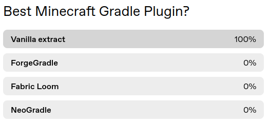

# Vanilla Extract

Vanilla Extract is a Gradle plugin for setting up a vanilla Minecraft project,
similar to [VanillaGradle]. It offers a couple of features that are useful for
[CC: Tweaked], but in doing so sacrifices the flexibility of similar plugins.

This project is not recommended for general use. This was written to solve
several issues specific to CC: Tweaked, and unless you have a similar use-case,
it may not be the most appropriate option. Both [VanillaGradle] and
[Architectury loom] are good alternatives.

# Features and non-features
 - Mojmap and Parchment support.
 - Split sources (common and client). Merged sources (like most mods do) are not
   supported.
 - Decompilation using Vineflower. This will also include Javadoc comments, if
   using Parchment.
 - Support for unlining constants using [Yarn]'s [unpick] definitions.

[VanillaGradle]: https://github.com/SpongePowered/VanillaGradle/
[CC: Tweaked]: https://github.com/cc-tweaked/CC-Tweaked
[unpick]: https://github.com/fabricMC/unpick
[Yarn]: https://github.com/fabricMC/yarn
[architectury loom]: https://github.com/architectury/architectury-loom
